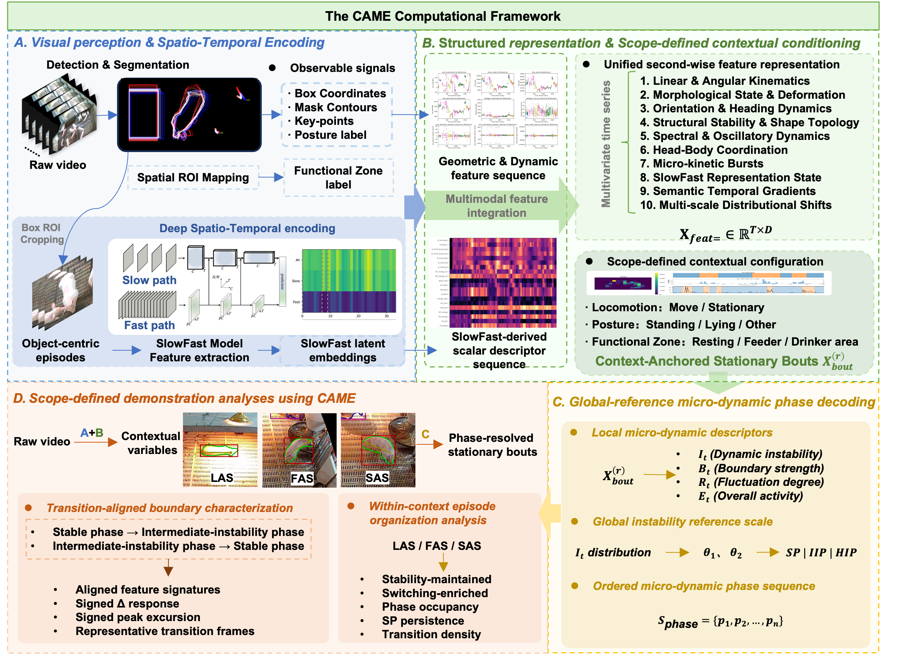

<p align="center">
  
</p>

---

<h1 align="center">CAME-MicroEthology</h1>

<p align="center">
  <strong>Context-Anchored Micro-Ethology for stationary-bout behavioural analysis</strong>
</p>

<p align="center">
  <em>An unsupervised computational framework for resolving micro-dynamic organisation within context-anchored stationary animal behaviour.</em>
</p>

<p align="center">
  🔬 Framework &nbsp;&nbsp;|&nbsp;&nbsp; 🧭 Context-anchored analysis &nbsp;&nbsp;|&nbsp;&nbsp; 🐖 Pig behaviour &nbsp;&nbsp;|&nbsp;&nbsp; 📊 Structured visual observations
</p>

This repository is associated with the manuscript:

**A Context-Anchored Micro-Ethological Computational Framework for Behavioural Analysis of Pigs in Stationary Bouts**

The repository is under active organisation. At this stage, it provides essential scripts and documentation for organising structured visual observations into anonymous tubelets and assessing visual-observation completeness.

## 🧠 Concept

<p align="center">
  
</p>

<p align="center">
  <em>Conceptual design of Context-Anchored Micro-Ethology.</em>
</p>

## 🗺️ Framework Overview

<p align="center">
  
</p>

<p align="center">
  <em>CAME converts structured visual observations into context-anchored stationary bouts, micro-dynamic phases and behavioural descriptors.</em>
</p>

## ✨ Scope

CAME operates after visual observations have been generated. Each object-level observation may include:

- bounding boxes;
- instance contours or masks;
- anatomical head-tail keypoints;
- coarse posture labels;
- functional-zone labels;
- anonymous local object identifiers.

<p align="center">
  
  
  
</p>

<p align="center">
  <sub><strong>Functional-zone visual observation</strong></sub>
  &nbsp;&nbsp;&nbsp;
  <sub><strong>Locomotion-aware visual observation</strong></sub>
  &nbsp;&nbsp;&nbsp;
  <sub><strong>Posture-associated representation</strong></sub>
</p>

<p align="center">
  
  
</p>

<p align="center">
  <sub><strong>Stationary bout visual observation</strong></sub>
  &nbsp;&nbsp;&nbsp;
  <sub><strong>Low-motion micro-dynamic observation</strong></sub>
</p>

> [!NOTE]
> CAME does not require long-term identity-preserved tracking. Instead, it organises detections into anonymous short-term tubelets for downstream micro-dynamic feature construction.

> [!TIP]
> CAME-MicroEthology assumes that structured visual observations have already been generated. The repository does not require a specific upstream detector or annotation format. The core workflow begins from cleaned visual-observation CSV files.

Example CSV files are provided in [`examples/minimal_csv`](examples/minimal_csv). These files illustrate the expected input schema, including frame index, anonymous local object ID, bounding box, instance contour, head-tail keypoints, posture label and functional-zone label. They are anonymised short tubelets for demonstrating the minimal CAME workflow, not the full dataset used in the manuscript.

## 👁️ Visual Front-End

CAME is model-agnostic with respect to upstream visual perception. In our study, visual observations were generated using:

- SAM3-based segmentation;
- YOLO-based posture classification;
- DeepLabCut ResNet-based head-tail keypoint estimation.

These models are optional upstream tools. CAME starts from cleaned visual-observation CSV files and does not redistribute SAM3, YOLO, DeepLabCut or their model weights.

See [Visual front-end](docs/visual_frontend.md) for optional installation notes and recommended input schema.

## ⚙️ Minimal Workflow

CAME starts from structured visual-observation CSV files rather than raw videos. The expected input is a frame-wise object-level table containing bounding boxes, instance contours or masks, head-tail keypoints, posture labels, functional-zone labels, frame numbers and anonymous local object identifiers.

The minimal core workflow includes:

1. second-wise feature extraction;
2. context-anchored stationary-bout extraction;
3. micro-dynamic phase decoding;
4. bout-level descriptor summarisation.

```bash
python scripts/run_minimal_demo.py \
  --input-dir examples/minimal_csv \
  --output-dir outputs/minimal_demo \
  --config configs/came_minimal.yaml \
  --fps 1.0
```

## 📚 Documentation

- [Input format](docs/input_format.md)
- [Visual front-end](docs/visual_frontend.md)
- [CAME workflow](docs/came_workflow.md)
- [Output files](docs/output_files.md)
