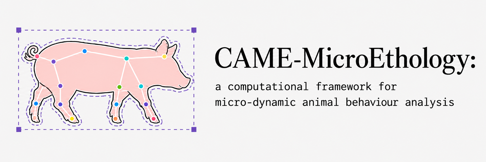
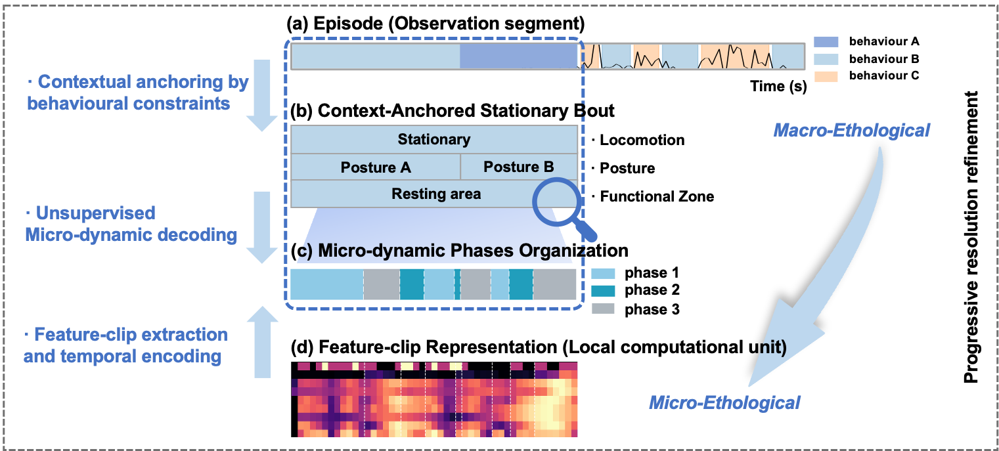

# CAME-MicroEthology

  

  <em>Overview of the Context-Anchored Micro-Ethology workflow.</em>

Context-Anchored Micro-Ethology (CAME) is an unsupervised computational framework for resolving micro-dynamic organisation within context-anchored stationary animal behaviour.

  

  <em>Overview of the Context-Anchored Micro-Ethology workflow.</em>

This repository is associated with the manuscript:

**A Context-Anchored Micro-Ethological Computational Framework for Behavioural Analysis of Pigs in Stationary Bouts**

The repository is under active organisation. At this stage, it provides essential scripts and documentation for organising structured visual observations into anonymous tubelets and assessing visual-observation completeness.

## Scope

CAME operates after visual observations have been generated. Each object-level observation may include:

- bounding boxes;
- instance contours or masks;
- anatomical head-tail keypoints;
- coarse posture labels;
- functional-zone labels;
- frame numbers;
- anonymous local object identifiers.

CAME does not require long-term identity-preserved tracking. Instead, it organises detections into anonymous short-term tubelets for downstream micro-dynamic feature construction.

CAME-MicroEthology assumes that structured visual observations have already been generated. The repository does not require a specific upstream detector or annotation format. JSON-to-CSV conversion scripts may be provided as optional utilities, but the core CAME workflow begins from cleaned visual-observation CSV files.

## Visual front-end

In our study, visual observations were generated using a SAM3-based segmentation workflow, a YOLO-based posture classification model, and a DeepLabCut ResNet-based head-tail keypoint estimator.

The data organisation follows the semi-automated workflow proposed in our Accelerated-Data-Engine project, where model-generated candidate outputs are manually reviewed, corrected or filtered before downstream analysis.

CAME itself is model-agnostic with respect to the upstream visual front-end. Users may replace SAM3, YOLO or DeepLabCut with other state-of-the-art models if the final outputs follow the CAME input schema.

This repository does not redistribute SAM3, YOLO, DeepLabCut, or their model weights.

## Minimal workflow

CAME starts from structured visual-observation CSV files rather than raw videos. The expected input is a frame-wise object-level table containing bounding boxes, instance contours or masks, head-tail keypoints, posture labels, functional-zone labels, frame numbers and anonymous local object identifiers.

The intended workflow is:

1. visual-observation completeness assessment;
2. second-wise feature extraction;
3. context-anchored stationary-bout extraction;
4. micro-dynamic phase decoding;
5. bout-level and episode-level descriptor summarisation;
6. figure source-data and diagnostic-plot export.

The corresponding scripts will be progressively organised in the `CAME_core_scripts/scripts/` directory.

## Documentation

- [Input format](docs/input_format.md)
- [Visual front-end](docs/visual_frontend.md)
- [CAME workflow](docs/came_workflow.md)
- [Output files](docs/output_files.md)